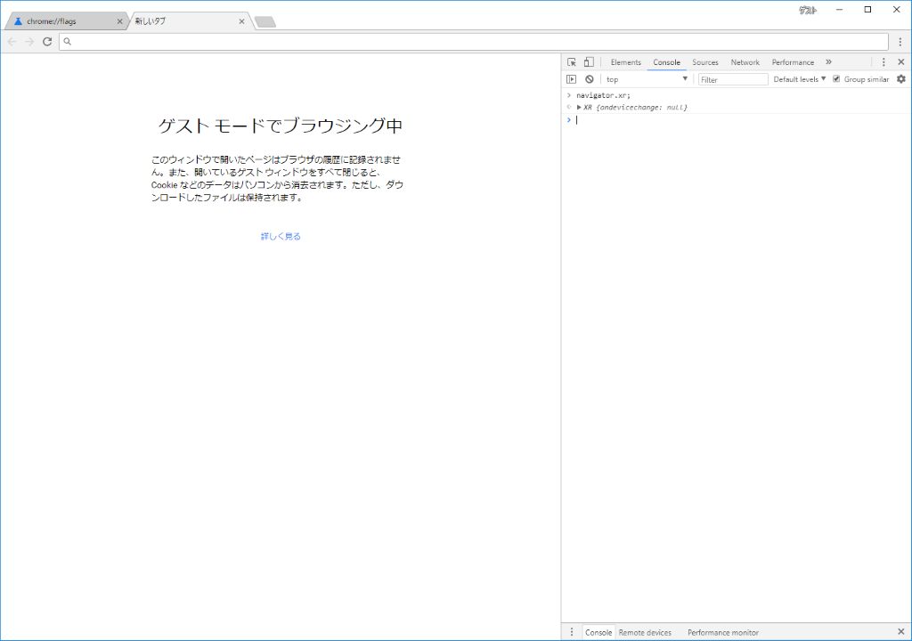
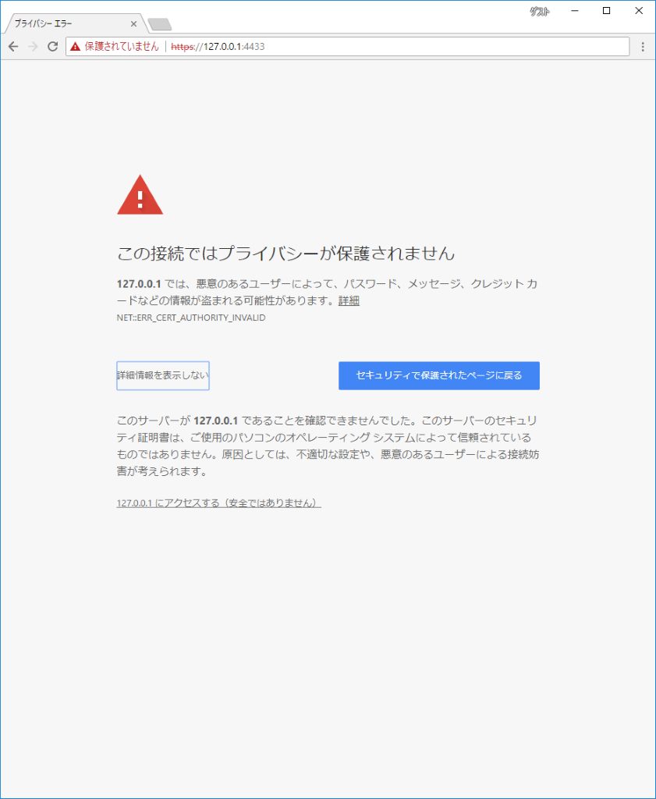
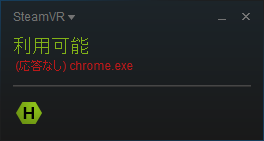
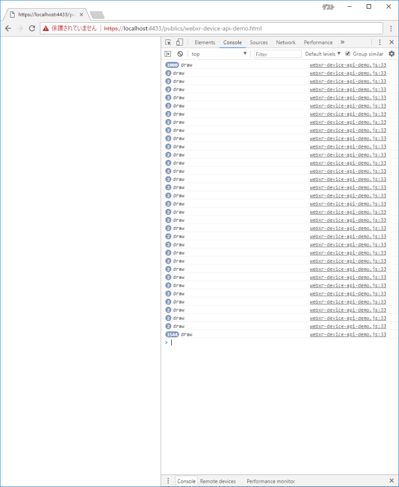
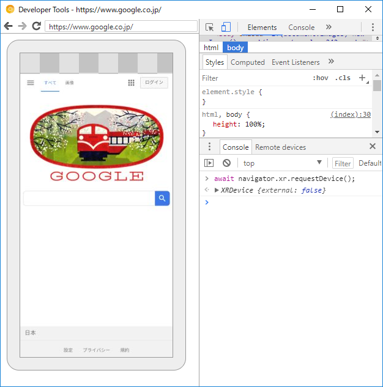
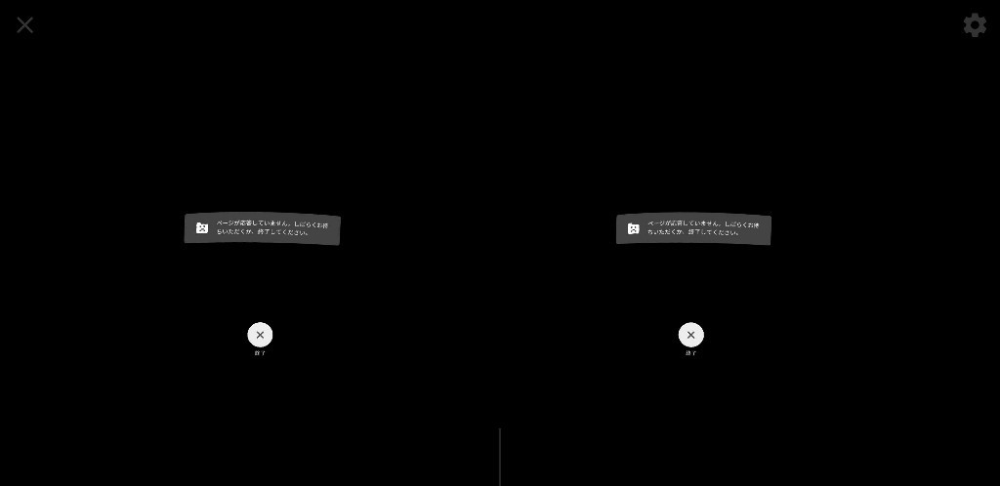
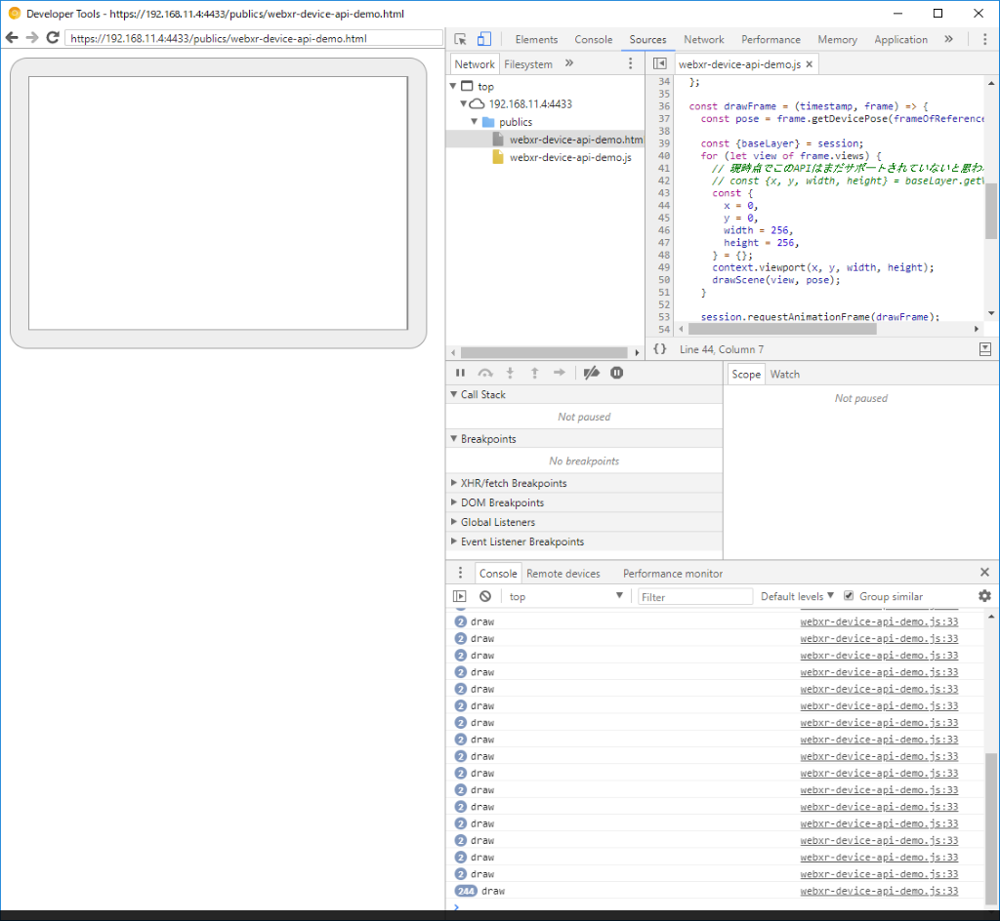

## WebXR Device APIについて

VR(仮想現実), AR(拡張現実), MR(複合現実)等の流行りの〇〇現実系がJavaScriptのAPIとして仕様の策定が進んでいます。

これまでにもVRヘッドセットのセンサー情報等にアクセスできる[WebVR API](https://developer.mozilla.org/ja/docs/Web/API/WebVR_API)の策定と実装がされ、そこそこ実用的なAPIとなっていましたが、
ARやMR等の〇〇現実系を視野にいれた[WebXR Device API](https://immersive-web.github.io/webxr/spec/latest/)としてインターフェースが統合されていくようです。


* [immersive-web/webxr](https://github.com/immersive-web/webxr/blob/master/explainer.md)

> WebXR Device APIは、
> Google Daydream、Oculus Rift、Samsung Gear VR、HTC Vive、及びWindows Mixed Realityヘッドセット等の、バーチャルリアリティ（VR）拡張現実感（AR）のハードウェアに関連する、入力・出力機器へアクセスする機能を提供します。
>
> 端的に言うとVRヘッドセットや、ARに対応したスマートフォンのような対応したハードウェアで見れるVR・ARのWebサイトを作成できます。

## Web開発者に強く期待されている

やや珍しく、[Chrome Platform Status / WebXR Device API](https://www.chromestatus.com/features/5680169905815552) の Consensus and standardization で `Web Developers: Strongy positive`となっている。


## Google Chrome Canary(67)でWebXR Device APIを試す

気が付いたらFlagでWebXR Device API有効化できるようになっていたので、[WebXR Device API Explained](https://github.com/immersive-web/webxr/blob/master/explainer.md)を斜めに読みながら簡単なコードを書いて試してみます。

ターゲットが最新のChromeなので容赦なくECMAScript7をベタに書いていく。

* [リポジトリ](https://github.com/misinoe/webxr-device-api-demo)
* [gh-pages](https://misinoe.github.io/webxr-device-api-demo/publics/webxr-device-api-demo.html)


### Canaryの導入

[Chrome Canary](https://www.google.co.jp/chrome/browser/canary.html)を導入します。

chrome://flagsを開き、必要そうなflagを有効にします。

* chrome://flags/#webxr
* chrome://flags/#openvr

恐らく、この２つを有効にする事でWebXR Device APIが使えるようになると思います。

Canary再起動後、devtoolのconsoleで `navigator.xr` にアクセスできるのを確認しました。


### SSLサーバーを建てる

結果論であるが、現状のCanaryではHTTPS接続でなければWebXR Device APIを使用できず、ローカルで検証を行う場合よくある自己署名の証明書を作る必要があった。

```sh
$ git clone https://github.com/misinoe/webxr-device-api-demo.git
$ cd webxr-device-api-demo

$ npm install
$ npm run cert

Enter連打

$ npm run ssl-serve
```

でSSLなローカルサーバーがポート4433番で立ち上がるので、https://localhost:4433/publics/ を開く。
その際に自己証明なので警告されるが、そのまま進める


### WebXR Device APIを使う

/publics/webxr-device-api-demo.html を開くと、次の箇所までとりあえず処理が流れる。

```js
const device = await navigator.xr.requestDevice();
await device.supportsSession({
  exclusive: true,
});
```

PCではこの時点でOpenXR APIか何かが叩かれて、SteamVRがChromeに反応し始めているのを確認できる。




そして、ページに「Tap Me!」が表示されるはずなので画面をクリック/タップし、ユーザーのアクティベーションで次の処理に進む。

```js
const session = await device.requestSession({
  exclusive: true,
});

const frameOfReference = await session.requestFrameOfReference('headModel');

await context.setCompatibleXRDevice(device);
session.baseLayer = new XRWebGLLayer(session, context);

const drawScene = (view, pose) => {
  console.log('draw');
};

const drawFrame = (timestamp, frame) => {
  const pose = frame.getDevicePose(frameOfReference);

  const {baseLayer} = session;
  for (let view of frame.views) {
    // 現時点でこのAPIはまだサポートされていないと思われる
    // const {x, y, width, height} = baseLayer.getViewport(view);
    const {
      x = 0,
      y = 0,
      width = 256,
      height = 256,
    } = {};
    context.viewport(x, y, width, height);
    drawScene(view, pose);
  }

  session.requestAnimationFrame(drawFrame);
};

session.requestAnimationFrame(drawFrame);
```

`XRWebGLLayer.getViewport()`はspecにはあるもののまだ未実装のようだ。

そして残念ながらヘッドマウントディスプレイに表示されている物は何も確認できていないが、`XRSession.requestAnimationFrame();`によってひとまずはWebXRの描画ループサイクルが毎秒数十回ぐるぐる回っているのを確認できる。




### Androidでの動作

Android版Chrome Canaryでも同様にWebXR Device APIをフラグで有効化すると`navigator.xr`にアクセスする事ができた。



ページを開き、「Tap Me!」のところでタップすると、DayDreamが立ち上がった。



その状態で、WebXRの描画ループまで動いているのをRemote Debugで確認した。



## 今回のまとめ

* ChromeでWebXR Device APIの実装が開始された
* 将来に期待しよう
