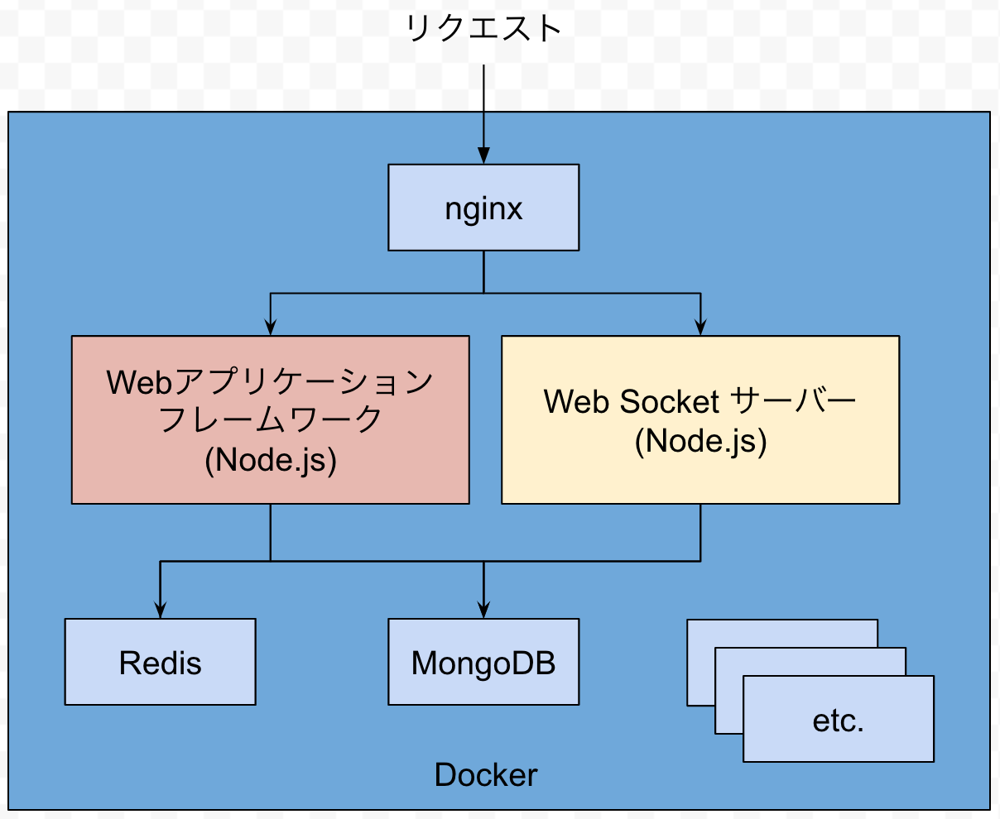
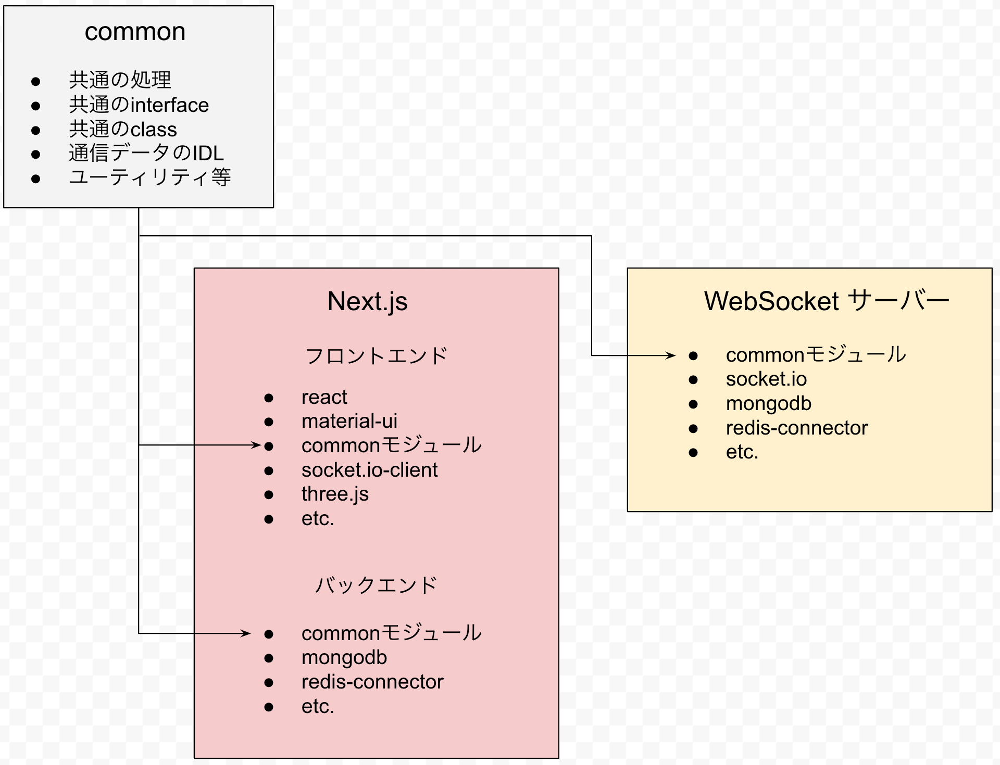
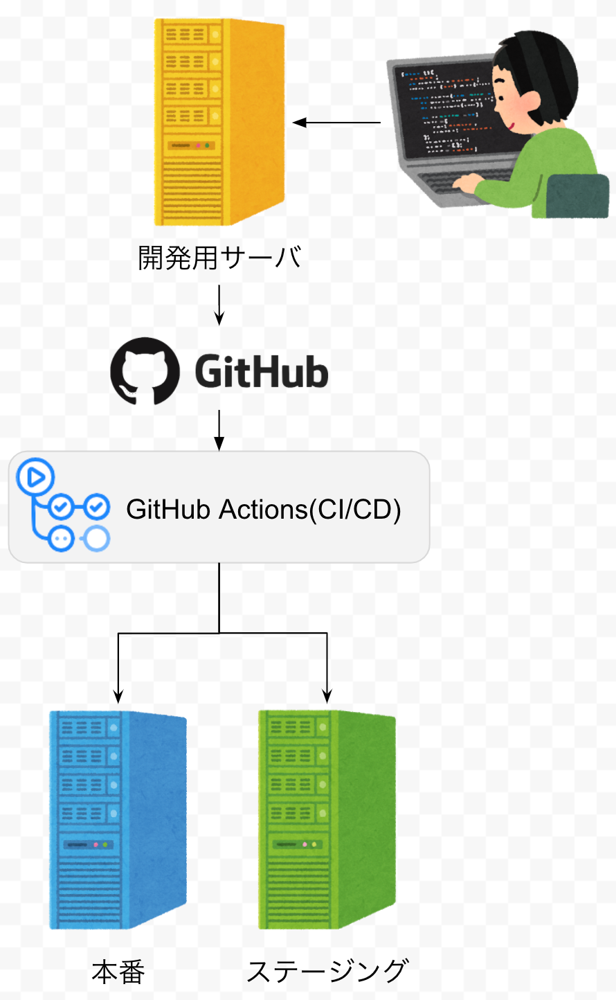

[前の記事](./2020-07-23-wn2la-architecutre-2.md)

# WN2:LineArtを構成する技術 ③コンテナ・TypeScript・CI/CD

## コンテナ構成

nginxを公開し、パスに応じてコンテナ間通信においてWebアプリケーションサーバーとWebSocketサーバーにリバースプロキシされます。

## TypeScriptの構成

共通のinterfaceやclassはcommon/で開発され、WebアプリケーションとWebSocketサーバーのコンテナにストレージとしてマウントされ、モジュールとして使用しています。

## CI/CDの構成

CI/CDはGitHub Actionsを利用しています。
developブランチにmergeされるとステージングに、masterブランチにmergeされると本番サーバーに自動デプロイされます。

続く
