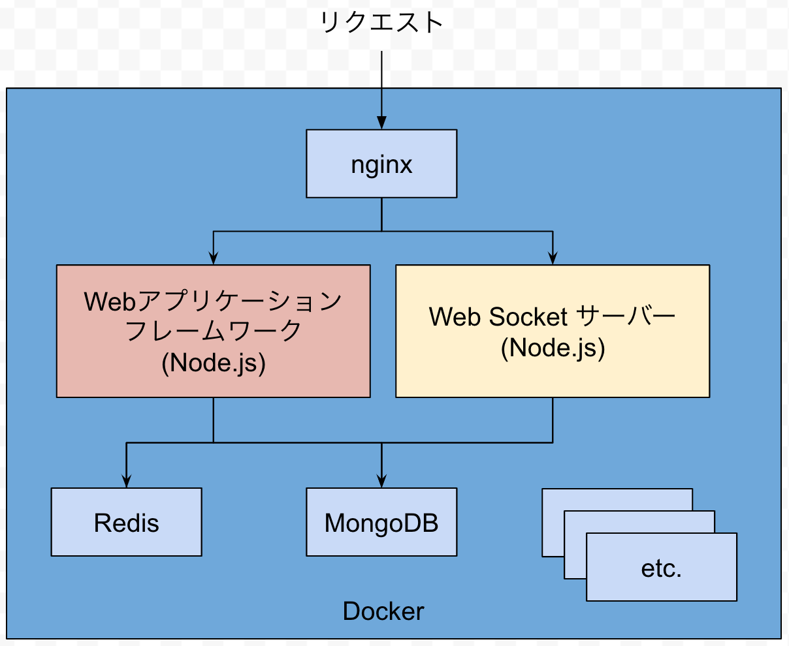
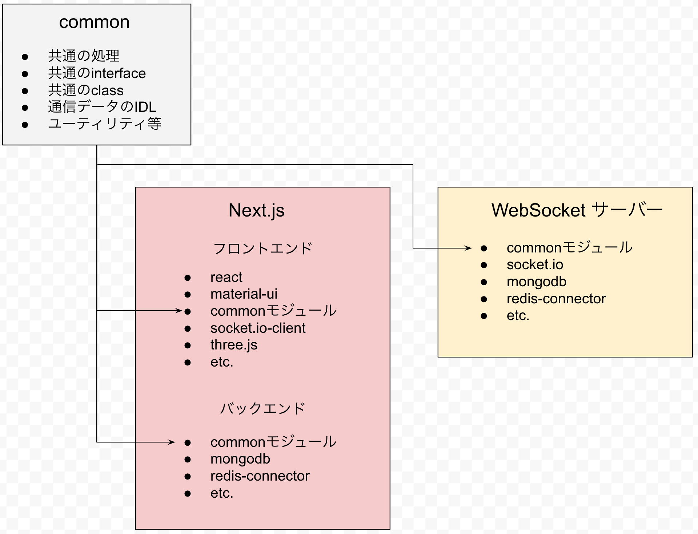
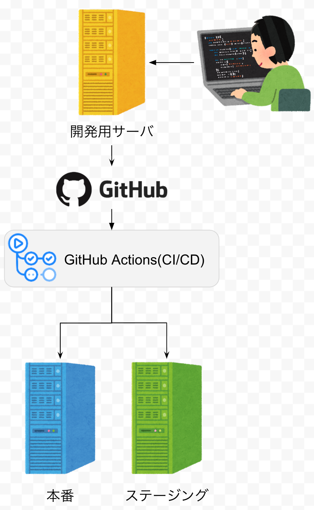

[前の記事](/wn2la-architecutre-2)

## コンテナ構成

nginxを公開し、パスに応じてコンテナ間通信においてWebアプリケーションサーバーとWebSocketサーバーにリバースプロキシされます。

## TypeScriptの構成

共通のinterfaceやclassはcommon/で開発され、WebアプリケーションとWebSocketサーバーのコンテナにストレージとしてマウントされ、モジュールとしてそれぞれに持ち込まれています。

## CI/CDの構成

CI/CDはGitHub Actionsを利用しています。
developブランチにmergeされるとステージングに、masterブランチにmergeされると本番サーバーに自動デプロイされます。

