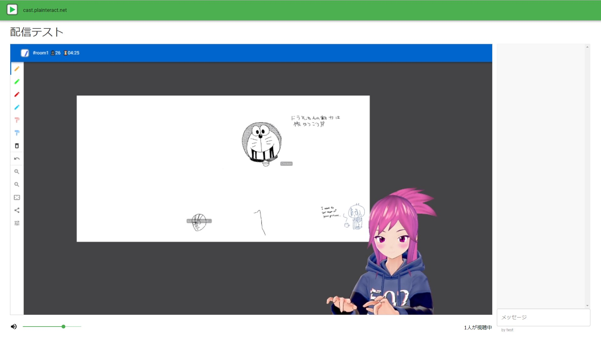
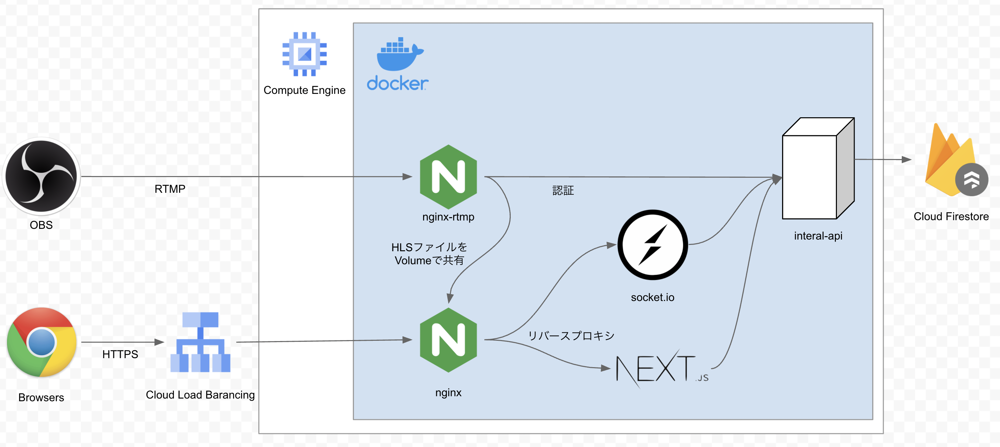
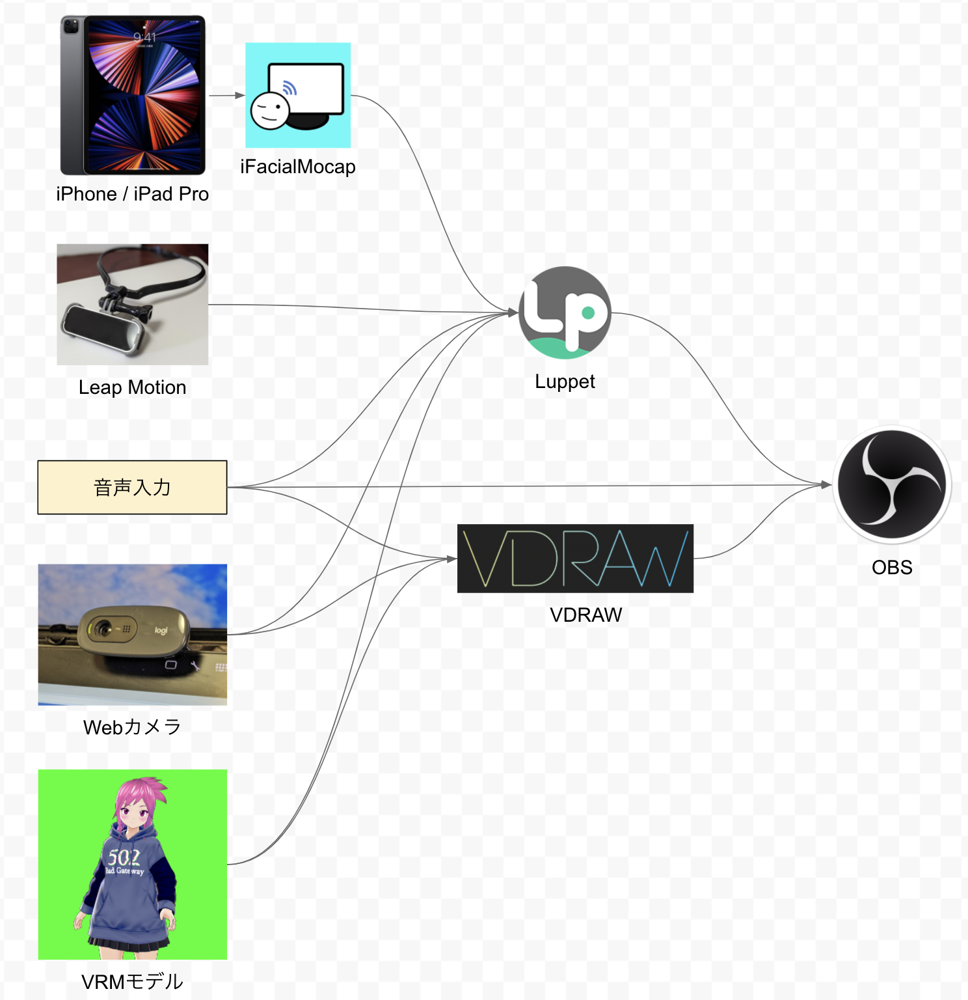
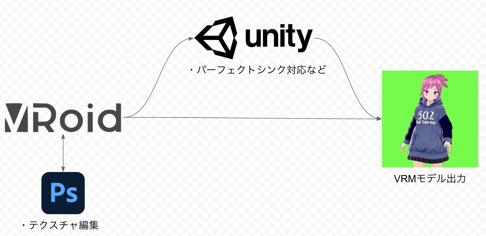
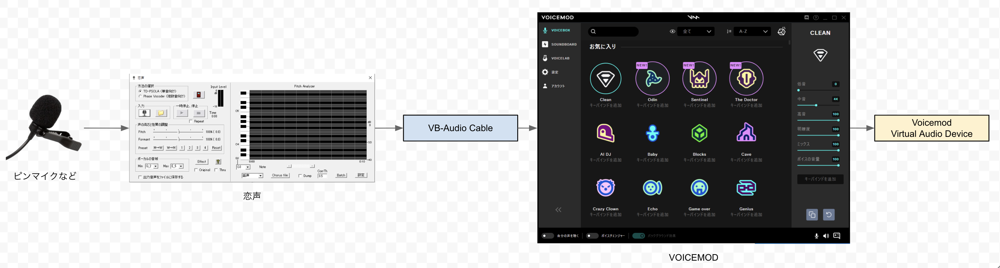

## 概要



HLSの配信/視聴システムを作り、3Dアバターを使ったバーチャル配信を行いました。
裏側はどういう仕組みになったか紹介していきます。


## サーバー構成

配信サーバー構成は次の通りです。





* スケールアウトを考慮した構成にはなっていません
* GCEで `docker-compose up` で起動する仕組み
* ロードバランサはHTTPSを使うためだけに存在する


### nginx-rtmpについて

図の通り `nginx-rtmp` は `OBS` からの `rtmp` ストリーミングを受け取り、 `hls` に変換する役目を担います。
変換された `hls` はdockerのVolumeを共有することにより、`nginx` コンテナから公開し、`next` アプリケーションから `hls.js` を利用しHLS動画が再生される仕組みとなっています。

**docker-compose.yml**

```
version: '3'
services:
  nginx-rtmp:
    build: ./nginx-rtmp
    ports:
      - 1935:1935
    volumes:
      - hls-volume:/var/hls
      - ./nginx-rtmp/nginx.conf:/etc/nginx/nginx.conf
    links:
      - internal-api
    restart: always
  nginx:
    build: ./nginx
    ports:
      - 80:8080
    volumes:
      - hls-volume:/var/hls
    restart: always
volumes:
  hls-volume:
```

```Dockerfile
FROM tiangolo/nginx-rtmp
COPY ./etc/nginx/nginx.conf /etc/nginx/nginx.conf

RUN apt-get -y update \
  && apt install -y ffmpeg \
  && mkdir -p /var/hls \
  && chmod -R o+rwx /var
```

RTMPでよく使われるポート `1935` をコンテナの外に公開します。

GCPのファイアウォールルールを設定します。
* 名前: rtmp
* ターゲットタグ: rtmp
* プロトコルとポート: tcp:1935

これをGCE・VMインスタンスに設定します。ネットワークタグ「rtmp」を追加。

続いてGCEに静的IPアドレスを割り振り、Aレコードを設定します。これでOBSから配信時に設定がしやすくなりました。
* 例: `rtmp://rtmp-server.plainteract.net:1935/hls`


#### nginx-rtmpのnginx.conf

**nginx-rtmp/nginx.conf**

```
worker_processes auto;
rtmp_auto_push on;
events {}

rtmp {
  server {
    listen 1935;
    application hls {
      live on;

      hls on;
      hls_path /var/hls;
      hls_nested on;

      hls_fragment 1s;
      hls_playlist_length 2s;

      on_publish http://internal-api:3000/api/rtmp-auth;
      notify_method get;

      exec chmod 755 /var/hls/$name;
    }
  }
}
```

ポイント
* `hls_path` に `nginx` コンテナと共有されるボリュームのパスを指定しています

補足
* この例では `on_publish` は、認証のため設定しています。
    - 叩かれる側、この場合 `http://internal-api:3000/api/rtmp-auth` にリクエストが飛び、そこがHTTP Status `200` 等を返すと、認証されたとみなし、HLSの保存が開始されます。
* 実際に動かすとパーミッションの問題が生じ、その上手な解決策が思いつかなかったため、`exec` でchmod 755しています。
* `hls_fragment` と `hls_playlist_length` の値は、大きくすると視聴時の遅延が大きくなり、小さくしすぎると視聴時に問題が生じたりしたため、絶妙に調整が必要です。


### nginxについて

一番表に立つnginxの設定です。
`nginx-rtmp` から貰ったHLSの配信、Webアプリケーション `next` や Chat機能を提供するための `socket` へのリバースプロキシを担当します。

#### nginx.conf

**nginx/docker-compose.yml**

```
server {
  listen 8080 default_server;
  server_tokens off;
  return 200;
}

server {
  listen 8080;

  root /var/www/html;

  location /hls/ {
    alias /var/hls/;

    types {
      text/html                     html
      application/vnd.apple.mpegurl m3u8;
      video/mp2t                    ts;
    }
  }

  location / {
    proxy_pass                          http://next:3000/;
    proxy_buffers                       64 4k;
    proxy_redirect                      off;
    proxy_set_header Host               $host;
    proxy_set_header X-Real-IP          $remote_addr;
    proxy_set_header X-Forwarded-For    $proxy_add_x_forwarded_for;
    proxy_set_header X-Forwarded-Proto  $scheme;
  }

  location /socket/ {
    proxy_pass                          http://socket:3000;
    proxy_redirect                      off;
    proxy_http_version 1.1;
    proxy_set_header Upgrade $http_upgrade;
    proxy_set_header Connection "upgrade";
    proxy_set_header Host               $host;
    proxy_set_header X-Real-IP          $remote_addr;
    proxy_set_header X-Forwarded-For    $proxy_add_x_forwarded_for;
    proxy_set_header X-Forwarded-Proto  $scheme;
  }
}
```

### next

Webアプリケーション開発フレームワークとして `Next.js` を利用しています。


#### コンテナ構成

**next/Dockerfile**

```
FROM node:14

WORKDIR /var/next

COPY . .

EXPOSE 3000
CMD ["sh", "start.sh"]
```

```start.sh
#!/bin/sh
if [ $STAGE = "development" ]; then
  yarn install
  yarn run dev
elif [ $STAGE = "production" ]; then
  yarn install --prod
  yarn run start
else
  exit -1
fi
```

#### アプリケーション構成

`Next.js` + `TypeScript` + `material-ui` をベースに、 `hls.js` で動画を再生、 `socket.io-client` でチャットを実装する構成になっています。

**next/package.json**

```
{
  "scripts": {
    "dev": "next",
    "start": "next start",
    "build": "next build"
  },
  "private": true,
  "dependencies": {
    "@material-ui/core": "^4.11.3",
    "@material-ui/icons": "^4.11.2",
    "@material-ui/styles": "^4.11.3",
    "hls.js": "^1.0.2",
    "next": "^10.1.3",
    "react": "^17.0.2",
    "react-dom": "^17.0.2",
    "socket.io-client": "^4.0.1",
    "styled-components": "^5.2.3"
  },
  "devDependencies": {
    "@types/node": "^14.14.41",
    "@types/react": "^17.0.3",
    "@types/styled-components": "^5.1.9",
    "gts": "^3.1.0",
    "typescript": "^4.2.4"
  }
}
```

以下、一部抜粋したコードになります。

**next/pages/live.tsx**

```
import * as React from 'react';
import HLS from 'hls.js';
import { io as SocketIO } from 'socket.io-client';

interface Props {
  liveId: string;
  streamKey: string;
}

export const getServerSideProps: GetServerSideProps<Props> = async (context) => {
  const liveId = dicision(context.query.liveId);

  const res = await fetch(`http://internal-api:3000/liveRoomInfo/${liveId}`);
  const liveRoomInfo = await res.json() as LiveRoomInfo;

  if (!liveRoomInfo.data.streamKey || !liveRoomInfo.data.enabled) {
    context.res.writeHead(302, {
      Location: '/portal',
    });
    context.res.end();
  }

  return {
    props: {
      liveId: liveRoomInfo.id,
      streamKey: liveRoomInfo.data?.streamKey || '',
    },
  };
};

const Live: React.FC<Props> = (props) => {
  const videoRef = React.useRef<HTMLVideoElement | null>(null);

  React.useEffect(() => {
    const socket = SocketIO({
      path: '/socket',
      query: {
        'liveId': props.liveId,
      },
    });
    socket.on('message', (message: string) => {
      // チャットの表示処理
    });
  }, []);

  React.useEffect(() => {
    if (!videoRef.current) return;
    const videoElement = videoRef.current;

    const hls = new HLS();

    hls.loadSource(`/hls/${props.streamKey}/index.m3u8`);
    hls.attachMedia(videoElement);
  }, [videoRef.current]);

  return <>
    <video ref={videoRef}>
  </>;
}
export default Live;
```

ポイント
* `nginx` の設定により `/hls` のパス以下でHLSの動画ファイルを再生します
* 同様に `/socket` のパスで、`socket` コンテナと通信します。
* 次で述べる通り、WebSocketの通信が定期的に切断される事を考慮する必要がありました。


その他画面はよしなに構成しました。

### socket

`socket.io` を使った、チャット機能を提供するためのコンテナです。

GCPのLBはコネクションドレインを防ぐため、初期設定で30秒でTransport層を切断します。(WebSocketは自動で認識すると記載があるが、何故か切断され、回避策は見つからなかった)
`socket.io-client` は初期設定で自動的に再接続を試みてくるので、切断と再接続が繰り返される前提でsocketサーバーを実装し対処しました。


### internal-api

ポートを外部公開せず、他のコンテナにREST APIを提供するためのコンテナです。
`nginx-rtmp` の認証や、`Firestore` データベースの読み書きを担当します。


## 3Dアバターの配信環境

次のような環境で配信しています




### OBS

`OBS` を使い、`Luppet` や `VDRAW` の画面を取得し、`nginx-rtmp` に動画をRTMPプロトコルで送信します。

[OBS](https://obsproject.com/)

シーンを追加し、ソースをよしなに構成。

設定画面を開き、配信の項目から次のように設定します。
* サービス: `カスタム`
* サーバー: `rtmp://<自分の立てたサーバー>:1935/hls`
* ストリームキー: `自分の設定したストリームキー`


配信解像度がサーバーの負荷に大きく関わるので、設定->出力の項目も絶妙に調整する必要がありました。


### Luppet

[Luppet](https://luppet.appspot.com/)

Personal版が6,000円です。

* 基本的にはWebカメラを使って、3Dアバターに表情等を同期させるソフトウェアです。
* iPhoneやiPadの `iFacialTracking` アプリと接続すると、より細かい表情をトラッキングできます。
* 記述時点でベータ版ですが、`パーフェクトシンク` に対応し、更に奥深い表情のトラッキングが可能です。(VRMモデル側の対応も必要)
* `Leap Motion` を接続すれば、アバターに手の動きをつける事が可能です。(15,000円ぐらい)
* [LeapMotion用ネックマウンタ](https://booth.pm/ja/items/1465959) (2,000円以下)と併用するととても良いです。


### VDRAW

* [VDRAW](https://sites.google.com/view/vdraw/)

1,000円。

* 3Dアバターにイラストやゲームプレイを演じさせる事のできるソフトウェアです。


絵チャットのイラストパートではVDRAWの画面を配信し、雑談パートではLuppetにOBSで切り替える運用で利用しました。


## 3Dアバター



* [VRoid](https://vroid.com/) を使って3Dアバターを作成しました。
* そのままでも利用可能ですが、 `パーフェクトシンク` に対応させるためは `Unity` でよしなに編集し、 `VRM` をエクスポートする必要があります。


## 音声




見た目の女性アバターに合わせた声を出力するため、発声方法を努力でコントロールし、努力では実現不可能な範囲をソフトウェアでカバーしました。


### 恋声

* フリーソフト
* 発声の努力と設定次第で出力がとても自然になる


### VOICEMOD

10,000円。

* `Man to Woman` や `Man to Woman 2` はかなり機械音声感が出てしまい、使う事はなかった...
