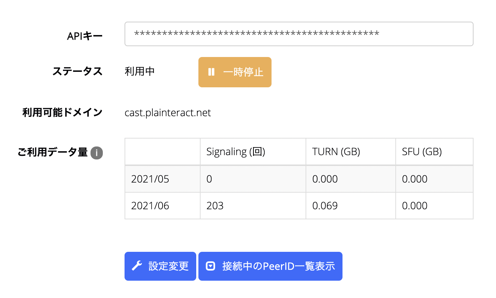

[前回の記事の通り](/cast-architecture) HLSを使った動画配信システムを構築し、実際に公開実験として数回の配信を行いました。

`nginx-rtmp` や `OBS` の設定を絶妙に調整しても、視聴者側には5~10秒程度の遅延が生じてしまいました。その遅延を解消するため `WebRTC` へ移行してみた記事になります。


## mediasoup

[mediasoup](https://github.com/versatica/mediasoup) はNode.js向けにもAPIが提供されているWebRTCのSFUです。
ちょっとガチ感を感じつつ、APIリファレンスも充実していて、Node.jsとTypeScriptで使えるという事で当初採用。

スープに対する容器という事で「Vessel」という名前にし、複雑なAPIの手続きをオブジェクト指向に糖衣して隠蔽する手法でチャレンジ。
サンプルのプロジェクトを参考にしつつ、以下のコードでローカルエリアネットワーク内で動作する所まで開発が進捗。

**media/src/Vessel.ts**
```
import { Server as SocketServer, Socket } from 'socket.io';
import * as mediasoup from 'mediasoup';
import type { types as Mediasoup } from 'mediasoup';
import { mediaCodecs } from './codecs';
import EventDispatcher from '@misinoe/typed-event-dispatcher';


type KindAndRtpParameters = {kind: 'video' | 'audio', rtpParameters: Mediasoup.RtpParameters};

export class VesselRoom {
  socketServer: SocketServer;
  worker: Mediasoup.Worker | undefined;
  router: Mediasoup.Router | undefined;

  produceTransport: Mediasoup.WebRtcTransport;
  producer: Mediasoup.Producer;

  private clients: VesselClient[] = [];

  constructor(request: {}) {
    this.initialize();
  }

  private async initialize() {
    this.worker = await mediasoup.createWorker({
      rtcMinPort: 34780,
      rtcMaxPort: 34999,
      logLevel: 'debug',
    });

    const {worker} = this;
    this.router = await worker.createRouter({
      mediaCodecs,
    });

    const {
      path = '/media',
      port = 3000,
    } = {};

    const socketServer = this.socketServer = new SocketServer({
      path,
    });

    socketServer.on('connection', (socket) => {
      const client = new VesselClient({
        room: this,
        socket,
      });
      this.clients.push(client);

      client.events.disconnect.once((client) => {
        this.clientWillDisconnect(client);
      });
    });

    socketServer.listen(port);
  }

  private clientWillDisconnect(client: VesselClient) {
    const {clients} = this;

    const index = clients.indexOf(client);
    if (index < 0) throw `Can't find client`;
    clients.splice(index, 1);
  }
}

class VesselClient {
  private room: VesselRoom;
  private socket: Socket;
  // private produceTransport: Mediasoup.WebRtcTransport;
  private cosumeTransport: Mediasoup.WebRtcTransport;
  private consumer: Mediasoup.Consumer;

  events = {
    disconnect: new EventDispatcher<VesselClient>(),
  };

  constructor(request: {room: VesselRoom, socket: Socket}) {
    this.room = request.room;
    this.socket = request.socket;

    const {socket} = this;
    socket.on('disconnect', () => {
      this.socketDisconnectHandler();
    });

    this.onSocketRequest('routerCapabilities', async () => {
      const {router} = this.room;
      const routerCapabilities: Mediasoup.RtpCapabilities = router.rtpCapabilities;

      return routerCapabilities;
    });

    this.onSocketRequest('createConsumerTransport', async () => {
      this.cosumeTransport = await this.createWebRtcTransport();

      const {cosumeTransport} = this;
      return {
        id: cosumeTransport.id,
        iceCandidates: cosumeTransport.iceCandidates,
        iceParameters: cosumeTransport.iceParameters,
        dtlsParameters: cosumeTransport.dtlsParameters,
      };
    });

    this.onSocketRequest('createProducerTransport', async () => {
      const {room} = this;

      room.produceTransport = await this.createWebRtcTransport();

      const {produceTransport} = room;
      return {
        id: produceTransport.id,
        iceCandidates: produceTransport.iceCandidates,
        iceParameters: produceTransport.iceParameters,
        dtlsParameters: produceTransport.dtlsParameters,
      };
    });

    this.onSocketRequest('connectProducerTransport', async (request: {dtlsParameters: Mediasoup.DtlsParameters}) => {
      const {dtlsParameters} = request;
      await this.room.produceTransport.connect({
        dtlsParameters,
      });
    });

    this.onSocketRequest('connectConsumerTransport', async (request: {dtlsParameters: Mediasoup.DtlsParameters}) => {
      const {dtlsParameters} = request;
      await this.cosumeTransport.connect({
        dtlsParameters,
      });
    });

    this.onSocketRequest<KindAndRtpParameters>('produce', async (request: {id: string, kind: Mediasoup.MediaKind, rtpParameters: Mediasoup.RtpParameters}) => {
      const {produceTransport} = this.room;
      this.room.producer = await produceTransport.produce({
        rtpParameters: request.rtpParameters,
        kind: request.kind,
      });

      return this.room.producer.id;
    });

    this.onSocketRequest<Mediasoup.RtpCapabilities>('consume', async (rtpCapabilities: Mediasoup.RtpCapabilities) => {
      const {room: {producer}} = this;
      const {cosumeTransport} = this;
      this.consumer = await cosumeTransport.consume({
        producerId: producer.id,
        rtpCapabilities: rtpCapabilities,
        // paused: producer.kind === 'video',
      });

      const {consumer} = this;

      return {
        producerId: producer.id,
        id: consumer.id,
        kind: consumer.kind,
        rtpParameters: consumer.rtpParameters,
        type: consumer.type,
        producerPaused: consumer.producerPaused
      };
    });
  }

  private async onSocketRequest<T = any>(name: string, closure: (param: T) => Promise<unknown>) {
    const {socket} = this;
    socket.on(name, async (param: T) => {
      const response = await closure(param);
      socket.emit(`re:${name}`, response);
    });
  }

  private async createWebRtcTransport() {
    const {router} = this.room;

    const transport = await router.createWebRtcTransport({
      listenIps: [
        {ip: '127.0.0.1'},
        {ip: '0.0.0.0', announcedIp: '192.168.12.7'},
      ],
      initialAvailableOutgoingBitrate: 1000000,
      enableUdp: true,
      enableTcp: true,
      preferUdp: true,
      enableSctp: true,
    });

    await transport.setMaxIncomingBitrate(1500000);

    return transport;
  }

  socketDisconnectHandler() {
    this.events.disconnect.dispatch(this);
  }
}
```

**next/libs/VesselClient.ts**
```
import {io as SocketIO, Socket} from 'socket.io-client';
import { Device } from 'mediasoup-client';
import type { types as Mediasoup } from 'mediasoup-client';
import { Stream } from 'node:stream';

type ProduceResponse = {kind: Mediasoup.MediaKind, rtpParameters: Mediasoup.RtpParameters};
type ConsumeResponse = {producerId: string, id: string, kind: Mediasoup.MediaKind, rtpParameters: Mediasoup.RtpParameters}

export class VesselClient {
  private device: Device;
  private socket: Socket;
  private videoProducer: Mediasoup.Producer;
  private audioProducer: Mediasoup.Producer;
  private dataProducer: Mediasoup.DataProducer;

  private consumer: Mediasoup.Consumer;

  constructor() {
    this.device = new Device();
  }

  async connectToVesselServer(path: string) {
    this.socket = SocketIO({
      path,
      autoConnect: false,
    });

    const {socket} = this;

    await new Promise<void>((resolve) => {
      socket.on('connect', resolve);
      socket.connect();
    });
  }

  async requestSocket<T>(requestName: string, params?: any): Promise<T> {
    const {socket} = this;
    return await new Promise((resolve) => {
      socket.emit(requestName, params);
      socket.once(`re:${requestName}`, (response: T) => {
        resolve(response);
      });
    });
  }

  private routerRtpCapabilities: Mediasoup.RtpCapabilities | undefined;

  async requestRouterCapabilities() {
    this.routerRtpCapabilities = await this.requestSocket<Mediasoup.RtpCapabilities>('routerCapabilities');

    const {device, routerRtpCapabilities} = this;
    await device.load({routerRtpCapabilities});

    return routerRtpCapabilities;
  }

  async subscribe() {
    const {device} = this;
    const transportOptions = await this.requestSocket<Mediasoup.TransportOptions>('createConsumerTransport');
    const receiveTransport = device.createRecvTransport(transportOptions);

    receiveTransport.on('connect', async (response: {dtlsParameters: Mediasoup.DtlsParameters}, successCallback: () => void, errorCallback: () => void) => {
      this.requestSocket('connectConsumerTransport', {
        transportId: transportOptions.id,
        dtlsParameters: response.dtlsParameters,
      }).then(successCallback).catch(errorCallback);
    });

    receiveTransport.on('connectionstatechange', async (state) => {
      console.log({state});
    });

    const {rtpCapabilities} = this.device;
    const consumeResponse = await this.requestSocket<ConsumeResponse>('consume', rtpCapabilities);

    this.consumer = await receiveTransport.consume({
      producerId: consumeResponse.producerId,
      id: consumeResponse.id,
      kind: consumeResponse.kind,
      rtpParameters: consumeResponse.rtpParameters,
    });

    const {consumer} = this;

    const mediaStream = new MediaStream();
    mediaStream.addTrack(consumer.track);
    return mediaStream;
  }

  async publish(publishMedia: {video: boolean, audio: boolean}) {
    const {device} = this;

    const transportOptions = await this.requestSocket<Mediasoup.TransportOptions>('createProducerTransport');
    const sendTransport = device.createSendTransport(transportOptions);

    sendTransport.on('connect', async (response: {dtlsParameters: Mediasoup.DtlsParameters}, successCallback: () => void, errorCallback: () => void) => {
      console.log('connected');
      this.requestSocket('connectProducerTransport', {
        transportId: transportOptions.id,
        dtlsParameters: response.dtlsParameters,
      }).then(successCallback).catch(errorCallback);
    });
    sendTransport.on('produce', async (response: ProduceResponse, successCallback: ({id: string}) => void, errorCallback: () => void) => {
      const producerId = await this.requestSocket<string>('produce', {
        transportId: sendTransport.id,
        kind: response.kind,
        rtpParameters: response.rtpParameters,
      });
      console.log('produce', producerId);
      successCallback({id: producerId});
    });

    sendTransport.on('connectionstatechange', (status: string) => {
      console.log({status});
      switch (status) {
        case 'connecting':
          break;
        case 'connected':
          break;
      }
    });

    const {video, audio} = publishMedia;
    const stream = await navigator.mediaDevices.getUserMedia({
      video,
      // audio,
    });

    if (video) {
      const videoTrack = stream.getVideoTracks()[0];
      this.videoProducer = await sendTransport.produce({
        track: videoTrack,
        encodings: [
          { maxBitrate: 100000 },
          { maxBitrate: 300000 },
          { maxBitrate: 900000 },
        ],
      });
    }

    return stream;
  }
}

```

**next/pages/play/cast.tsx**
```
import { VesselClient } from 'libs/VesselClient';
import * as React from 'react';

interface Props {}

const Play: React.FC<Props> = () => {
  // const [vesselClient, setVesselClient] = React.useState<VesselClient | null>(null);
  const videoRef = React.useRef<HTMLVideoElement>();

  React.useEffect(() => {
    (async () => {
      const vesselClient = new VesselClient();
      await vesselClient.connectToVesselServer('/media');
      await vesselClient.requestRouterCapabilities();
      const stream = await vesselClient.publish({video: true, audio: true});
      if (videoRef.current) videoRef.current.srcObject = stream;
    })();
  }, []);

  return <>
    <video controls autoPlay ref={videoRef}></video>
  </>;
}

export default Play;
```

**next/pages/play/receive.tsx**
```
import { VesselClient } from 'libs/VesselClient';
import * as React from 'react';

interface Props {}

const Play: React.FC<Props> = () => {
  const videoRef = React.useRef<HTMLVideoElement>();

  React.useEffect(() => {
    (async () => {
      const vesselClient = new VesselClient();
      await vesselClient.connectToVesselServer('/media');
      await vesselClient.requestRouterCapabilities();
      const stream = await vesselClient.subscribe();

      console.log({stream});
      if (videoRef.current) videoRef.current.srcObject = stream;

    })();
  }, []);

  return <>
    <video controls autoPlay ref={videoRef}></video>
  </>;
}

export default Play;
```

見ての通りコード量が多くなりました。
ここまでやっても、やはりAPIが複雑で仕組みをパーフェクトに理解できない事に不安を覚え、他の手段の模索を開始しました。


## PeerJS

PeerJSに出会います。
簡便なAPIで、昔から多く使われている模様。
メンテナンスも行われている事から試験的に使用を開始しました。

以下のコードで、receive側のIDをcast側に手動入力を要しつつ、動画/音声の配信ができました。

現時点でNext.jsでpeerjsをimportする時、SSR時に `navigator is not defined` のエラーが生じるため、require部分を工夫する必要がありました。

**next/pages/live/cast.tsx**
```
import * as React from 'react';
import Layout from 'components/Layout';
import type PeerType from 'peerjs';

let Peer: typeof PeerType;
if (typeof navigator !== 'undefined') {
  Peer = require("peerjs").default;
}

const Cast: React.FC = (props) => {
  const [mediaStream, setMediaStream] = React.useState<MediaStream | null>(null);
  const [peer, setPeer] = React.useState<PeerType | null>(null);
  const [peerId, setPeerId] = React.useState<string | null>(null);

  const callIdInputRef = React.useRef<HTMLInputElement>();
  const [callId, setCallId] = React.useState<string | null>();

  React.useEffect(() => {
    (async () => {
      console.log('media');
      const mediaStream = await new Promise<MediaStream>((resolve, reject) => {
        navigator.getUserMedia({video: true, audio: true}, resolve, reject)
      });

      setMediaStream(mediaStream);
    })();
  }, []);


  React.useEffect(() => {
    const peer = new Peer({
      host: 'localhost',
      port: 8080,
      path: '/peer',
      config: {
        iceServers: [
          {urls: 'stun:stun.l.google.com:19302'},
          {urls: 'stun:stun1.l.google.com:19302'},
        ],
      },
    });
    setPeer(peer);

    peer.on('connection', (connection) => {
      console.log('connection', connection);
    });
    peer.on('open', (id) => {
      console.log('open', id);
      setPeerId(id);
    });

    return () => {
      peer.disconnect();
    }
  }, []);

  React.useEffect(() => {
    if (!peer || !mediaStream) return;

    peer.on('call', (call) => {
      call.answer(mediaStream);
    });
  }, [mediaStream, peer]);

  const call = (callId: string) => {
    peer.call(callId, mediaStream);
  };

  return <Layout title="Peer">
    <p>{peerId}</p>
    <input ref={callIdInputRef}></input>
    <button onClick={() => {call(callIdInputRef.current?.value || '')}}>Call</button>
  </Layout>
}
export default Cast;
```

**next/pages/live/receive.tsx**
```
import * as React from 'react';
import Layout from 'components/Layout';
import type PeerType from 'peerjs';

let Peer: typeof PeerType;
if (typeof navigator !== 'undefined') {
  Peer = require("peerjs").default;
}

const Receive: React.FC = (props) => {
  const videoRef = React.useRef<HTMLVideoElement>();
  const [peer, setPeer] = React.useState<PeerType>();
  const [peerId, setPeerId] = React.useState<string | null>(null);


  React.useEffect(() => {
    const peer = new Peer({
      host: 'localhost',
      port: 8080,
      path: '/peer',
      config: {
        iceServers: [
          {urls: 'stun:stun.l.google.com:19302'},
          {urls: 'stun:stun1.l.google.com:19302'},
        ],
      },
    });
    setPeer(peer);

    peer.on('connection', (id) => {
      console.log('connection', id);
    });
    peer.on('open', (id) => {
      console.log('connection', id);
      setPeerId(id);
    });

    peer.on('call', call => {
      call.answer();
      call.on('stream', stream => {
        console.log(stream);
        videoRef.current.srcObject = stream;
      });
    });

    return () => {
      peer.disconnect();
    }
  }, []);

  return <Layout title="receive">
    <p>{peerId}</p>
    <video ref={videoRef} controls autoPlay></video>
  </Layout>;
};

export default Receive;
```

またSTUNサーバーを自前で建てる場合は次の通りでできました。簡単。

**peer/src/index.ts**
```
import {PeerServer} from 'peer';

const peerServer = PeerServer({
  port: 3000,
  proxied: true,
  path: '/peer',
  allow_discovery: true,
});

peerServer.on('connection', (client) => {
  console.log('connection', client);
});
```

ここまで作りましたが、TURNサーバーをどうしようという問題に衝突します。


## SkyWay

そして `NTT Communications` が提供する `SkyWay` を知ります。
STUN/TURN/SFU全てが提供されていて、料金形態は無料版と有料版の2つ存在しています。


50万回/月、TURNとSFUが500GB/月と、個人で利用するには十分。
ただしそれを超える場合は月額11万円~と、法人を想定した価格…きっと超えないと思いつつ。


**next/libs/peer.ts**
```
import Peer from 'skyway-js';

export const createPeer = () => {
  const peer = new Peer({
    key: process.env['NEXT_PUBLIC_SKYWAY_API_KEY'],
  });

  return peer;
};

export {
  Peer,
}
```

**next/pages/cast/[liveId].tsx**
```
import * as React from 'react';
import {createPeer, Peer} from 'libs/peer';

const Cast: React.FC<Props> = (props) => {
  const previewVideoRef = React.useRef<HTMLVideoElement | null>(null);
  const [mediaStream, setMediaStream] = React.useState<MediaStream | null>(null);

  React.useEffect(() => {
    const peer = createPeer();

    peer.on('open', (id) => {
      const meshRoom = peer.joinRoom(props.liveId, {
        mode: 'mesh',
        stream: mediaStream,
      });
    });

    return () => {
      peer.disconnect();
    }
  }, [mediaStream]);

  React.useEffect(() => {
    if (!previewVideoRef.current) return;

    navigator.getUserMedia({
      video: {
        width: {max: 1280},
        height: {max: 720},
      },
      audio: true,
    }, (mediaStream) => {
      previewVideoRef.current.srcObject = mediaStream;
      setMediaStream(mediaStream);
    }, () => {});
  }, [previewVideoRef.current]);

  return <>
    <video muted autoPlay ref={previewVideoRef} width="100%"></video>
  </>;
};
```


**next/pages/play/[liveId].tsx**
```
import * as React from 'react';
import {createPeer, Peer} from 'libs/peer';
...

const Play: React.FC<Props> = (props) => {
  const videoRef = React.useRef<HTMLVideoElement | null>(null);
  const [mediaStream, setMediaStream] = React.useState<MediaStream | null>(null);

  React.useEffect(() => {
    const peer = createPeer();

    peer.on('open', (id) => {
      setPeer(peer);
      setPeerId(id);

      const meshRoom = peer.joinRoom(props.liveId, {
        mode: 'mesh',
      });

      meshRoom.on('stream', (stream) => {
        setMediaStream(stream);
      });
    });

    return () => {
      peer.disconnect();
    }
  }, []);

  React.useEffect(() => {
    if (!videoRef.current) return;
    if (!mediaStream) return;

    videoRef.current.srcObject = mediaStream;
  }, [videoRef.current, mediaStream]);

  ...

  return <>
    <video controls autoPlay muted={muted} ref={videoRef}></video>
  </>;
};

export default Play;
```

おおよそ、上記のようなコードで配信/視聴の仕組みが完成しました。


## テスト配信と結果

SkyWayを利用するコードに置き換えて、再び配信のテストをおこいました。


<blockquote class="twitter-tweet"><p lang="ja" dir="ltr">み虐 <a href="https://t.co/20mQqj4w6z">pic.twitter.com/20mQqj4w6z</a></p>&mdash; ほの🍖からる🍆 (@hono_ESW9) <a href="https://twitter.com/hono_ESW9/status/1404083616506793984?ref_src=twsrc%5Etfw">June 13, 2021</a></blockquote> <script async src="https://platform.twitter.com/widgets.js" charset="utf-8"></script>


約3時間の配信でリスナー数は平均約10人、SkyWayのAPI利用カウントは次の通り。




リスナーの報告によると、動画の遅延はなんと1秒未満に抑えられていたとの事。


## まとめ

* HLSの配信遅延を解消しようとWebRTCにチャレンジした
* mediasoupはとても難しく、結果的には挫折した
* PeerJSはAPIが簡便で使いやすい事がわかった
* しかしTURNサーバーをどうするかという問題が浮上してくる
* SkyWayはSTUN/TURN/SFUを提供してくれて、PeerJSと同じぐらい簡便なAPIで無料枠の幅が広い、素晴らしいソリューションだと思った
* 配信遅延を1秒未満に抑える事に成功した
